# Simulation of Epidemic Spreading in Various Network Topologies
## by Duncan Hall

### Abstract

### Replication of Pastor-Satorras and Vespignani's experiment

Replicating the simulations of Pastor-Satorras and Vespignani, we used a SIS virus model where each node has two possible states: susceptible or infected. Once infected and recovered a node is once again susceptible to the simulated virus (with no immunity). We tested the simulation with graph topologies from three different models: [Erdős–Rényi](https://en.wikipedia.org/wiki/Erdős–Rényi_model), [Watts-Strogatz](https://en.wikipedia.org/wiki/Watts–Strogatz_model), and [Barabási–Albert](https://en.wikipedia.org/wiki/Barabási–Albert_model). The simulation was run in discrete time steps after each of which a node's state was determined as follows:

  - infected nodes recover to susceptible with probability δ
  - susceptible nodes with no infected neighbors remain susceptible
  - susceptible nodes with one or more infected neighbors become infected with probability ν

Because the simulation is not meant to reflect on any particular time scale, the behavior of the simulation depends only on the ratio λ = ν / δ. We can therefore fix δ = 1 guaranteeing that infected nodes will recover in exactly one time step. Despite the simplicity of this model it manifests a core concept in epidemiology: the notion of a critical viral spreading rate λc in any network. In simulations where λ < λc, we observe the virus dying out after a short period while where λ > λc, we see the virus becoming endemic, reaching most of the nodes of the network in short order and surviving indefinitely. Figure 1 below illustrates the criticality of λ across the three topologies considered.

 
| 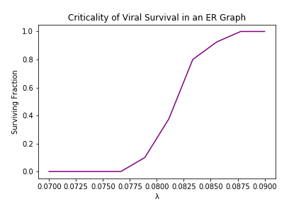 | 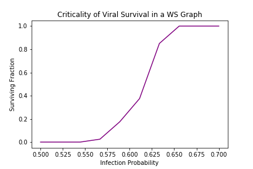 | 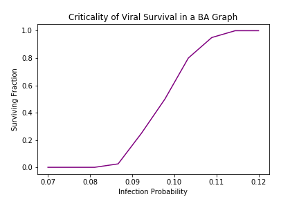 |
|-|-|-|
 
*Figure 1 – Criticality of virus survival on λ for multiple topologies. For each value of λ we count the fraction of 40 trials in which the virus survives to time step t = 100.*

 

In Pastor-Satorras and Vespignani it is suggested that scale free models with BA topologies are unique in that their characteristic λc is dependent on size:

*"The first arresting evidence from simulations [of BA topologies] is the absence of an epidemic threshold, i.e., λc = 0. This implies that for any finite value of λ the virus can pervade the system with a finite prevalence, in sufficiently large networks."*

In other words, a virus with any spreading rate λ will persist in a suitably large network. However with Figures 2 and 3 we discover that this trait is in fact not unique at all to BA networks. λc in all three network topologies is dependent on size, leaving one to wonder: what is so distinct about BA models?

 
| 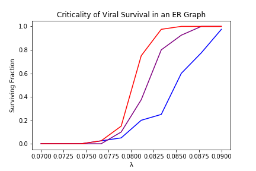 | 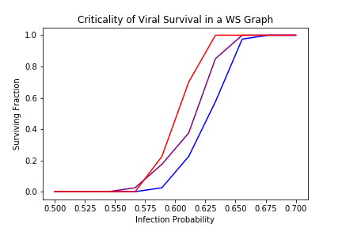 | 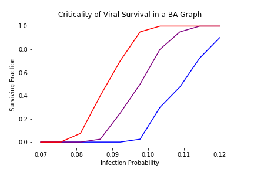 |
|-|-|-|
 
*Figure 2 – λc is dependent on network size for all three topologies. Parameters are identical to Figure 1 with each topology tested at n = 2500 (blue), n = 5000 (purple), and n = 10000 (red). According to Pastor-Satorras and Vespignani we should expect variance in survival with network size only in the BA model.*
 

 
| 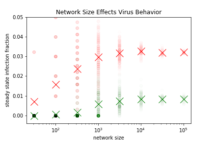 | 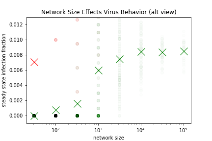 |
|-|-|
 
*Figure 3 – Compares ER (red) and BA (green) steady-state infection fractions as size scales. Circles are individual trial states, X's mark mean averages. Models do not appear qualitatively different (see alternate view on right).*
 

As validation, we can recreate the data presented by Pastor-Satorras and Vespignani in the following figures, which focus only on BA graphs.

  

#### Figures Replicating Pastor-Satorras and Vespignani

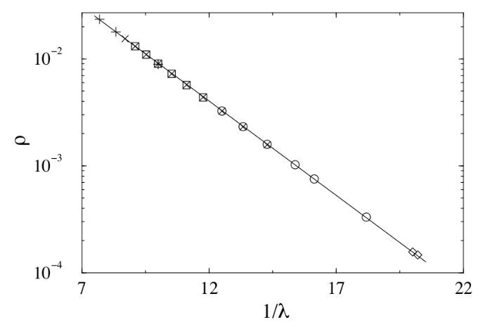
 
*Figure 4.1. "Persistence ρ as a function of 1/λ for different network sizes: N = 105 (+), N = 5 × 105
(◻), N = 106 (×), N = 5 × 106 (○), and N = 8.5 × 106 (◇). The linear behavior on the
semi-logarithmic scale proves the stretched exponential behavior predicted for ρ. The full line is a
fit to the form ρ ∼ exp(−C/λ)." [1]*
 

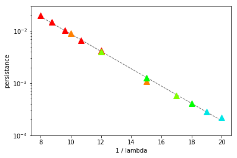
 
*Figure 4.2. We quantitatively replicate the original plot shown in Figure 4.1 with each color corresponding to a network size in the original experiment. We confirm that the persistence ρ is indeed semi-logarithmically linear.*
 

We can even plot the same relation in ER topologies:

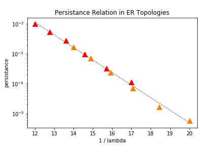
 
*Figure 4.2. We quantitatively replicate the original plot shown in Figure 4.1 with each color corresponding to a network size in the original experiment. We confirm that the persistence ρ is indeed semi-logarithmically linear.*
 

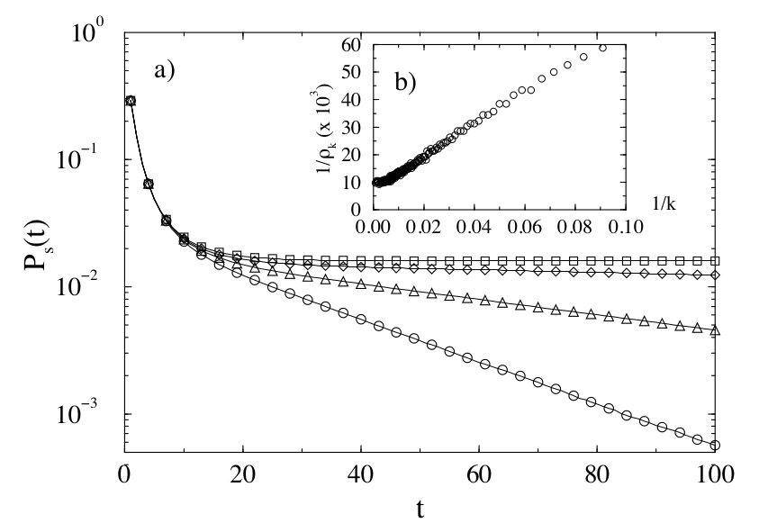
 
*Figure 5.1. a) "Surviving probability Ps(t) for a spreading rate λ = 0.065 in scale-free networks of
size N = 5 × 105 (◻), N = 2.5 × 104 (◇), N = 1.25 × 104 (△), and N = 6.25 × 103 (○). The
exponential behavior, following a sharp initial drop, is compatible with the data analysis of Figure 4.1" [1]*
 

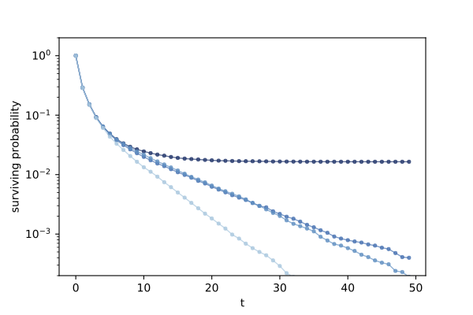
 
*Figure 5.2. We qualitatively replicate the original plot shown in Figure 5.1. Note that we run the simulation for 50 time steps due to time complexity.*
 

### Conclusion

I realize that to formally argue against Pastor-Satorras and Vespignani (2001) there is much more ground to cover, but I will contend that this publication includes some inaccuracies which I have attempted to begin to outline here. Later models for epidemic spreading relying on adjacency matrix eigenvalues date this approach on the whole however, so if there are indeed inaccuracies here I suspect they are unlikely to be explored.

### Bibliography

#### [1]. [Epidemic spreading in scale-free networks](https://github.com/SeunginLyu/EpidemicSpreading/blob/master/papers/epidemic_spreading_in_SF_networks.pdf)

Pastor-Satorras, R., & Vespignani, A. (2001). Epidemic spreading in scale-free networks. Physical review letters, 86(14), 3200.

Pastor-Satorras and Vespignani  designed a model for the spreading of infections on scale-free networks. They applied the susceptible-infected-susceptible (SIS) epidemiological model on scale-free graphs (Barabasi and Albert). They believe that models with SIS applied to Euclidean lattices, ER graphs, and WS graphs aren’t completely adequate to represent the real phenomenon because the end behavior after time *t* eventually yields either complete extinction or complete prevalence of a computer virus depending on whether the effective spreading rate is greater or less than the epidemic threshold. They discover the absence of the epidemic threshold in scale-free networks and conclude that “infections can proliferate on these scale-free networks whatever spreading rates they may have. These very bad new are, however, balanced by the exponentially small prevalence for a wide range of spreading rate”.

#### [2]. [Epidemic spreading in Real Networks : An Eigenvalue Viewpoint](https://github.com/SeunginLyu/EpidemicSpreading/blob/master/papers/epidemic_threshols_real_networks_eignevalue.pdf)

Wang, Y., Chakrabarti, D., Wang, C., & Faloutsos, C. (2003, October). Epidemic spreading in real networks: An eigenvalue viewpoint. In Reliable Distributed Systems, 2003. Proceedings. 22nd International Symposium on (pp. 25-34). IEEE.

Wang, Yang and Chenxi Wang proposed a ‘general’ epidemic threshold condition that applies to arbitrary graphs and prove that the epidemic threshold is closely related to the largest eigenvalue of its adjacency matrix under reasonable approximations. They point out that the model proposed by Pastor-Satorras and Vespignani is only limited to the BA graph and only works heavily under the assumption that gamma = 3 when *P(k) = k^(-gamma)* (*P(k)* is the probability that a node has *k* links). They validate their epidemic spreading model on both homogeneous graphs like ER graph and power-law scale free graphs like the BA graph. They conclude that their threshold condition holds for arbitrary graphs by validating their model through extensive experiments on real and synthesized graphs.

#### [3]. [Epidemic Thresholds in Real Networks](https://github.com/SeunginLyu/EpidemicSpreading/blob/master/papers/epidemic_thresholds_real_netowkrs.pdf)

Chakrabarti, D., Wang, Y., Wang, C., Leskovec, J., & Faloutsos, C. (2008). Epidemic thresholds in real networks. ACM Transactions on Information and System Security (TISSEC), 10(4), 1.
Chicago

They present a new analytic model called NLDS(nonlinear dynamic system) that makes no assumptions about the network topology and show that their model performs as well or better than the previous models that are targeted specifically to fit certain special case graphs like ER, WS, and BA graphs. This model is an improved version of <i>Epidemic Spreading in Real Networks : An Eigenvalue Viewpoint</i> (written five years later by almost the same group of author). They conclude that their threshold condition can be used to design new network topologies that are more resistant to viruses.
